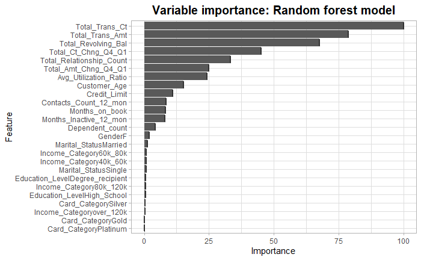
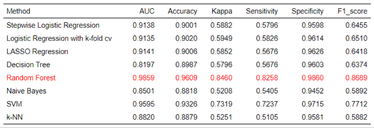

<link rel="stylesheet" href="styles.css" type="text/css">
<link rel="stylesheet" href="site_libs/academicons-1.9.1/css/academicons.min.css"/>

   

## **Predicting Customer Churn**

 

 

### 1. Figure

[Fig. Random forest features by importance]

 

[Fig. Result of models]

  

### 2. Goal
For the stability of the company's financial problems, create a model to predict what customer has a high risk of leaving the bank's credit card services.

 

### 3. Methodology & Summary

  + Random Forest has best model compared to other with Kappa, Sensitivity, Specificity and F1 score has shown at least 96% accuracy. Random Forest have AUC score of 98% that shows the model is learning the data well enough.

 

### 4. Code

Please click [[HERE](files/Predict_Chrun_Customer_No_Code.html)] for the analysis report and code.

 

