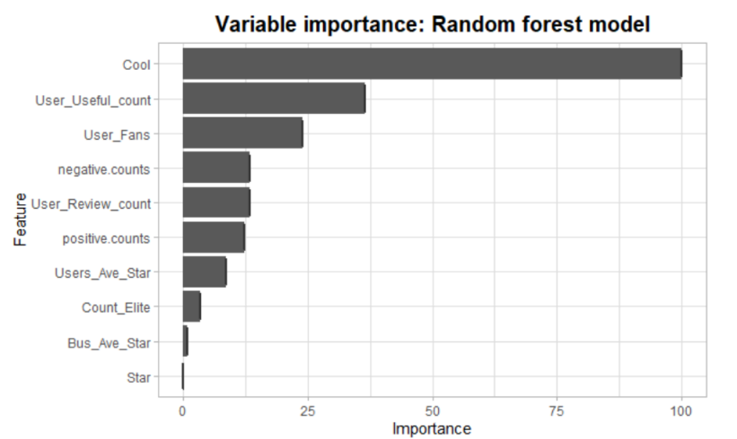
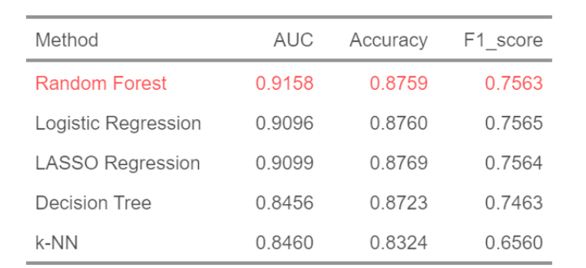

<link rel="stylesheet" href="styles.css" type="text/css">
<link rel="stylesheet" href="site_libs/academicons-1.9.1/css/academicons.min.css"/>

   

## **Predicting the Useful Values with Machine Learning Models**

 

   

### 1. Figure

[Fig. Random forest features by importance]

 

[Fig. Result of models]

  

### 2. Goal
To determine which machine learning model provides the best prediction of whether a review on California restaurants on Yelp will be voted as "useful" by users.

 

### 3. Methodology & Summary

  + Random Forest has an AUC score of 91.58% that shows the model is learning the data well enough.
  + By using the Random Forest model that we made, the restaurants can predict whether a review is useful or not even before people start pressing a useful button on Yelp. If a review is useful, which is written as a reasonable good, bad or both things, the restaurants need to change the customers’ complaints or maintain the good contents the reviewers have told for their restaurants’ development.

 

### 4. Report

Please click [[HERE](files/Useful_Review_Prediction.pdf)] for the final report.

 

